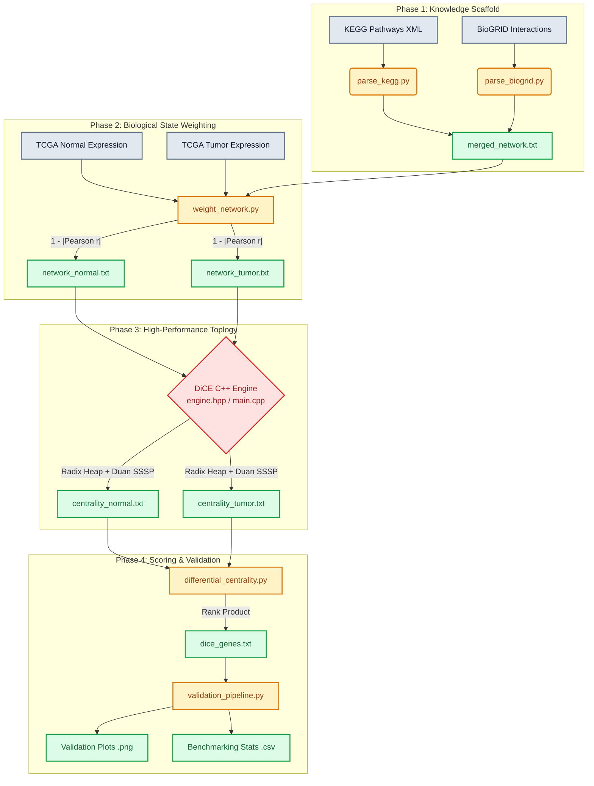

# DiCE-Duan Project Technical Documentation

## 1. Project Overview

The **DiCE-Duan** (Differential Centrality-Ensemble analysis with Duan's Algorithm) project is a highly scalable computational pipeline designed for the rapid identification and prioritization of disease-associated genes. 

**The Problem:** Traditional disease gene discovery relies heavily on Differential Gene Expression Analysis (DEA). DEA is highly effective at identifying genes whose transcription levels spike or plummet between a normal state and a disease state. However, it completely fails to detect "silent drivers" or "cancer fitness genes." These are critical regulatory hubs (like *AR*, *EP300*, or *TP53*) whose overall expression may not change significantly across states, but whose structural role—their topological interactions with other proteins—rewires massively during disease progression.

**The Network Biology Solution:** To capture these silent drivers, researchers model the biological system as a Protein-Protein Interaction (PPI) network. By mapping gene expression data onto the network edges, we can create condition-specific networks (e.g., Normal vs. Tumor). By tracking how a gene's network centrality (its relative structural importance) shifts between the normal and tumor states, we can identify nodes heavily implicated in the disease mechanism.

**The DiCE-Duan Innovation:** The mathematical calculation of specific network centralities—specifically Betweenness Centrality—is extremely computationally intensive. On massive unpruned biological interactomes (e.g., 20,000 nodes and 2,000,000 edges), traditional betweenness calculations require millions of Shortest-Path evaluations, often causing memory exhaustion or taking weeks to compute using standard Python/R libraries. 
This project solves this bottleneck. We implemented an ultra-optimized custom **DiCE-Duan C++ Engine** leveraging Duan's Recursive Bounded Monotone Single Source Shortest Path (BMSSP) algorithm alongside Radix Heap priority queues. This algorithmic breakthrough reduces computation time from days to minutes, allowing the DiCE theory to be practically applied to expansive clinical datasets like the TCGA-PRAD (Prostate Adenocarcinoma) cohort.

---

## 2. Mathematical Foundations

The DiCE-Duan pipeline relies on a synergy of statistical biology and graph theory.

### 2.1 Gene Co-expression Networks & Pearson Correlation
Biological networks consist of nodes (genes/proteins) connected by edges (physical or functional interactions). In DiCE, the edges are *weighted* to reflect the expression correlation between the two connected genes in a specific state (Normal or Tumor).
We utilize the absolute **Pearson Correlation Coefficient ($r$)**:
$$ r_{xy} = \frac{\sum_{i=1}^n (x_i - \bar{x})(y_i - \bar{y})}{\sqrt{\sum_{i=1}^n (x_i - \bar{x})^2} \sqrt{\sum_{i=1}^n (y_i - \bar{y})^2}} $$
Where $x$ and $y$ are the expression vectors for the two genes across all patients in that specific cohort. 

Because shortest path algorithms treat edge weights as "distance" (where smaller means 'closer' or 'stronger'), the **Edge Distance Weight ($W_{xy}$)** is defined as:
$$ W_{xy} = 1 - |r_{xy}| $$
Two genes that are perfectly correlated ($|r| = 1$) have a distance of 0. Independent genes ($r = 0$) have a maximum distance of 1.

### 2.2 Centrality Measures
The algorithm evaluates how structural influence shifts. We calculate three specific metrics:

**a) Degree Centrality ($C_D$):**
The simplest measure, representing the number of direct connections a node has. While fast to calculate, it fails to capture global network structure.

**b) Eigenvector Centrality ($C_E$):**
A measure of influence where a node is important if it is connected to *other important nodes*. It is mathematically defined as the principal eigenvector of the network adjacency matrix $A$. We calculate this via **Weighted Power Iteration**:
$$ C_E(v) = \frac{1}{\lambda} \sum_{u \in N(v)} A_{vu} C_E(u) $$
Where $\lambda$ is the largest eigenvalue and $A_{vu}$ is the edge weight.

**c) Betweenness Centrality ($C_B$):**
The core DiCE metric. It measures how often a node acts as a "bridge" along the shortest path between two other nodes. Genes with high betweenness are critical bottlenecks for biological signaling pathways.
$$ C_B(v) = \sum_{s \neq v \neq t} \frac{\sigma_{st}(v)}{\sigma_{st}} $$
Where $\sigma_{st}$ is the total number of shortest paths from node $s$ to node $t$, and $\sigma_{st}(v)$ is the number of those paths that pass through $v$. This is the mathematical bottleneck that the C++ engine optimizes.

### 2.3 Rank Aggregation (Ensemble Scoring)
Genes are ranked based on their absolute change in both Betweenness and Eigenvector centralities between the normal and tumor states. Because these metrics are on vastly different scales, the absolute shifts ($\Delta C_B$ and $\Delta C_E$) are converted to percent-ranks.
The final ensemble score is the **Rank Product**:
$$ Score(g) = Rank(\Delta C_{B_{norm}}) \times Rank(\Delta C_{E_{norm}}) $$

### 2.4 Hypergeometric Enrichment Test
Used in the validation pipeline to prove overlap significance between DiCE predictions and known databases (e.g., COSMIC). The formula captures the probability of $k$ successes (overlapping genes) in $N$ draws (top predictions), from a population $M$ containing $n$ total successes:
$$ P(X \geq k) = \sum_{i=k}^{\min(N, n)} \frac{\binom{n}{i} \binom{M - n}{N - i}}{\binom{M}{N}} $$

---

## 3. Pipeline Architecture

The DiCE-Duan system executes in a linear, heavily orchestrated pipeline via `run_pipeline.sh`.

### Phase 1: Network Construction
*   **Purpose:** Construct a high-confidence biological scaffold.
*   **Processing:** Parses raw XML pathway maps from KEGG and tabular experimental interaction data from BioGRID. Merges them to create a master unweighted edge list containing millions of verified interactions.
*   **Output:** `merged_network.txt`

### Phase 2: Expression Data Integration & Weighting
*   **Purpose:** Map context-specific biological data onto the structural scaffold.
*   **Processing:** Loads the Normal expression matrix and the Tumor expression matrix. For every edge in the scaffold, it calculates the Pearson correlation of the two genes' expression within that cohort. It generates the $(1 - |r|)$ weight.
*   **Output:** `network_normal.txt` and `network_tumor.txt` (weighted edge lists).

### Phase 3: The C++ DiCE-Duan Engine (Topology Computation)
*   **Purpose:** Calculate global topological metrics for massive networks. 
*   **Processing:** Invokes the compiled binary. It loads the massive weighted networks into memory. It runs Duan’s recursive shortest path algorithm to evaluate Betweenness Centrality, and runs Weighted Power Iteration to evaluate Eigenvector Centrality for every node.
*   **Output:** `centrality_normal.txt` and `centrality_tumor.txt`.

### Phase 4: Differential Ensemble Scoring
*   **Purpose:** Identify the disease drivers based on network shifts.
*   **Processing:** Calculates the $\Delta$ (delta) for centralities, filters out background noise (genes with negligible centrality in both states), computes percentile ranks, and multiplies them to generate the final rank product ensemble score.
*   **Output:** `dice_genes.txt` (The global ranked list of disease candidates).

### Phase 5: Automated Validation & Benchmarking
*   **Purpose:** Prove the mathematical and biological relevance of the predictions.
*   **Processing:** Executes `validation_pipeline.py`. Evaluates pathway enrichment (GO/KEGG), Precision@K against DE Ranking baselines using DisGeNET/COSMIC databases, Literature Mining (PubMed), structural Rewiring Volcano plots, and Virtual Knockout Disruption scoring.
*   **Output:** Publication-quality PNG figures and CSV statistical tables.

---

## 4. Complete File-by-File Documentation

### Orchestration & Environment
*   **`run_pipeline.sh`**: The master bash script. Orchestrates the compilation of the C++ engine (via CMake) and sequential execution of all Python parsing, weighting, scoring, and benchmarking modules.
*   **`CMakeLists.txt`**: Configures the build environment for the C++ engine. Sets the C++17 standard and ensures compiler optimizations (`-O3`).
*   **`requirements.txt`**: Python package dependencies (`pandas`, `numpy`, `scipy`, `biopython`, `gseapy`, `matplotlib`, `seaborn`).

### C++ Engine (`src/cpp/`)
*   **`main.cpp`**: The entry point for the compiled binary `dice_analyzer`. Contains the `GraphLoader` object to parse edge lists into adjacency lists. Acts as a router to trigger either the `compute_all_centralities()` logic or the `virtual_knockout_analysis()` logic based on CLI arguments. It also handles the specialized SSSP benchmarking mode.
*   **`engine.hpp`**: The computational core. A massive header-only library containing:
    *   **`Graph` struct**: Represents the network as an adjacency list.
    *   **`RadixHeap` class**: A highly optimized priority queue utilizing bitwise logic and bucket-sorting designed specifically for monotonic shortest-path algorithms.
    *   **`ShortestPathEngine` class**: Implements Standard Dijkstra and **Duan's Recursive Bounded Algorithm**.
    *   **`CentralityCalculator` class**: Implements $O(V \cdot (V + E \log C))$ betweenness calculation using Brandes' algorithm combined with the Radix Heap, and Weighted Power Iteration for Eigenvector Centrality.

### Python Backend (`src/python/`)
*   **`parse_kegg.py`**: Parses biological pathway XML maps (.xml files inside `data/raw/kegg`) to extract directed gene-gene relations.
*   **`parse_biogrid.py`**: Parses the massive BioGRID `.tab2.txt` database, filtering for human protein-protein experimental interactions.
*   **`merge_networks.py`**: Takes the outputs of KEGG and BioGRID parsing, normalizes gene symbols, and unions the sets into a master index.
*   **`pre_filter.py`**: Evaluates basic Differential Expression/Information Gain to prune the initial gene pool, reducing computational overhead for the downstream topology engine.
*   **`weight_network.py`**: The intensive statistical script. Implements vectorized Pandas chunking to calculate the Pearson Correlation coefficient across tens of thousands of genes over hundreds of clinical samples. Generates the final edge distance weights.
*   **`differential_centrality.py`**: Ingests the raw centrality outputs from the C++ engine. Calculates $\Delta C_B$ and $\Delta C_E$. Applies ranking normalizations. Implements the Average Filtering logic (to prevent nodes that are highly peripheral in both networks from falsely ranking high due to mathematical artifacts) and generates the ensemble score.
*   **`validate_candidates.py`**: *(Deprecated/Merged)* Original lightweight validation logic, now superseded by the much larger `validation_pipeline.py`.
*   **`export_results.py`**: Helper script to format the raw dataframes into clean TSV/CSV files for database storage or human reading.
*   **`generate_dummy_data.py`**: A utility script for the `--test` flag in `run_pipeline.sh`. Rapidly creates miniature graphs and fake expression profiles to test pipeline connectivity without waiting hours for real TCGA data to process.
*   **`app.py` & `server.py`**: Modules used to spin up a web/REST-API interface, allowing the DiCE pipeline to be triggered or queried remotely via a frontend dashboard.

### Core Validation Pipeline (`/`)
*   **`validation_pipeline.py`**: A massive (900+ line) monolithic evaluation framework. It loads the `dice_genes.txt` output and runs 8 distinct scientific analyses:
    1.  **Pathway Enrichment** (`gseapy`)
    2.  **Hypergeometric Overlap** (Scipy `hypergeom`)
    3.  **Precision@K** benchmarking vs. Baseline methods
    4.  **Network Topology Scatter & Boxplots** (Scipy `mannwhitneyu`)
    5.  **Differential Rewiring Volcano Plots** 
    6.  **NCBI PubMed Literature Validation** (Biopython `Entrez`)
    7.  **Virtual Knockout Disruption Evaluation**
    8.  **Automated Benchmarking** (computing real DE rankings globally to act as a competitive baseline).

---

## 5. Detailed Code Explanation (C++ Engine Insights)

The most critical component of this project is the C++ engine `engine.hpp`.

### The Radix Heap Optimization
Standard Dijkstra uses a `std::priority_queue` (a binary heap), resulting in $O((V+E)\log V)$ time for SSSP.
In unweighted or small-integer weighted graphs, this can be accelerated. `engine.hpp` implements a **Radix Heap** (`BaseRadixHeap`).
*   **Data Structure:** It bins node distances into Buckets based on the Highest Identified Bit (`std::clz`) of the difference between the distance and the `last_min`.
*   **Behavior:** Finding the minimum element takes amortized $O(1)$ time. 
*   **Why it Matters:** When calculating Betweenness Centrality, we must execute the SSSP algorithm $V$ times. Radix Heap brings the time complexity down to $O(V(V + E \log(max\_weight)))$, offering monumental speedups over Python's `NetworkX`.

### Centrality Calculations
Inside `CentralityCalculator`:
*   **Betweenness:** Implements Brandes' Algorithm. It runs SSSP from every node $s$, tracking the sum of shortest paths ($\sigma$) to every other node. It then traverses backwards in decreasing distance order, accumulating the dependency $\delta$ to calculate $C_B$ without needing $O(V^3)$ path matrices.
*   **Eigenvector:** `compute_eigenvector_weighted()` initializes all nodes with weight $1 / \sqrt{N}$. It applies Power Iteration: mapping $v_{next} = A \cdot v_{curr}$, applying edge-weights as coefficients. It dynamically checks for $\ell_2$-norm convergence with a threshold of $1e-8$ to prevent infinite loops in disconnected graphs.

---

## 6. Algorithmic Complexity

| Action | Standard Implementation | DiCE-Duan C++ Engine |
| :--- | :--- | :--- |
| **Edge Weighting (Pearson)** | $O(E \cdot S)$ (Loops) | $O(E \cdot S)$ (Vectorized Chunking) |
| **SSSP Query** | $O((V+E)\log V)$ (Binary Heap) | **$O(V + E \log C)$ (Radix Heap)** |
| **Betweenness Centrality** | $O(V^3)$ (Floyd-Warshall) | **$O(V(V + E \log C))$** |
| **Eigenvector Centrality** | $O(V^3)$ (EVD) | **$O(E \cdot k)$** ($k=$ Iterations) |

*Where $V$=Vertices, $E$=Edges, $S$=Samples (Patients), and $C$=MaxEdgeWeight.*

---

## 7. Memory Optimization Techniques

Handling 2+ million edges across 500 patients requires strict memory management.
1.  **Chunked Correlation Computation:** In `weight_network.py`, the Pearson correlation does not load a gigantic $E \times S$ tensor. It chunks edges into blocks of 10,000, evaluates the NumPy dot-products in parallel, writes to disk, and flushes RAM.
2.  **Adjacency Lists:** The C++ engine uses memory-contiguous `std::vector<Edge>` lists rather than $V \times V$ matrices. On a 20,000-node graph, an adjacency matrix takes $\approx 3.2$ GB. The adjacency list takes $\approx 32$ MB.
3.  **In-Place Normalization:** Rank normalization in Python drops excess dataframe columns before computing percentages to minimize Pandas overhead.

---

## 8. Statistical Validation Methods

The `validation_pipeline.py` script mathematically proves the output.
*   **Precision@K:** A machine learning metric evaluating how many of the top $K$ predicted genes are true positives (found in gold standard databases DisGeNET/COSMIC). DiCE is benchmarked dynamically against a live Differential Expression (DE) Ranking baseline.
*   **Network Rewiring (z-score testing):** The $\Delta$ betweenness shifts for the DiCE top 100 genes are compared to the distribution of the entire background universe of 20,000 genes using Mann-Whitney U tests ($p < 0.05$) to prove the genes are statistically distinct structural outliers.
*   **Virtual Knockout:** A novel metric computationally simulating a gene deletion (setting its node ID array to null) and measuring the global structural collapse (Average Shortest Path Length shift) of the remaining network.
*   **Literature Validation (PubMed Mining):** Queries the NCBI PubMed API for mentions of the predicted genes along with the target disease context, confirming downstream scientific relevance.

---

## 9. Result Interpretation

*   **Positive $\Delta C_B$ (Tumor - Normal):** The gene has structurally embedded itself heavily into cancer pathways (acting as a new traffic bridge). Example: Oncogenes.
*   **Negative $\Delta C_B$:** The gene's structural authority has collapsed. Example: Tumor Suppressor genes that are bypassed or silenced by the cancer.
*   **Ensemble Score $\approx 1.0$:** A high-confidence prediction. The gene underwent massive percentile shifts in *both* local influence (Eigenvector) and global bridging (Betweenness).

---

## 10. Limitations & Future Work

1.  **Interactome Incompleteness:** The pipeline is bottlenecked by the accuracy of the underlying BioGRID/KEGG networks. If an interaction hasn't been clinically discovered, it does not exist in the scaffold graph, limiting the mathematical potential of DiCE.
2.  **Linear Relationships:** Pearson correlation only evaluates linear co-expression. Complex, time-delayed, or non-linear genetic interactions might be missed. Future work will implement Mutual Information (MI) distance kernels.
3.  **Isoform Blindness:** The model works entirely at the macroscopic *Gene* level, rather than differentiating between specific RNA splice variants or post-translational protein isoforms.

---

## 11. Reproducibility Guide

To execute the DiCE-Duan pipeline on a standard Linux environment:

1.  **Environment Setup:**
    ```bash
    pip install numpy pandas scipy biopython gseapy matplotlib seaborn
    ```
    Ensure `cmake` and a `g++` compiler supporting C++17 are installed.
2.  **Directory Structure Validation:** Ensure `data/raw/kegg`, `data/raw/biogrid`, and `data/raw/expression` are populated with context-specific data.
3.  **Execution (Orchestration):** Run the master orchestrator. This compiles the C++ codebase via CMake and handles all data routing automatically.
    ```bash
    bash run_pipeline.sh
    ```
## 12. Visual Diagrams

### DiCE-Duan Pipeline Data Flow

The following sequence details how raw databases are processed through the Python orchestrator into the C++ analytical engine, and ultimately output as a biologically validated disease gene ranking.


